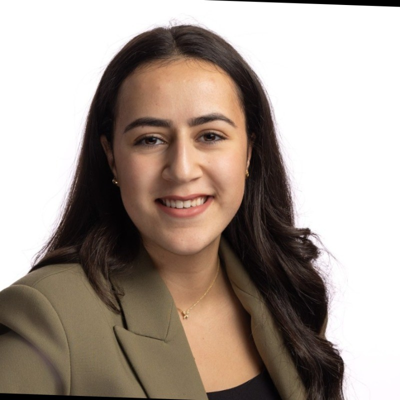

## Mr Kien Hang

<figure markdown>
  { width="300" align=left}
  <figcaption>Co-Founder</figcaption>[:fontawesome-brands-twitter:](https://twitter.com/) [:fontawesome-brands-linkedin:](https://www.linkedin.com/in/kien-hang-4b1bba149/)
</figure>

Lorem ipsum dolor sit amet consectetur adipisicing elit. Quam voluptatum perferendis veritatis! Aliquam id a magni ad voluptas quaerat reiciendis rem eum officia iste, temporibus iure fugit, numquam omnis totam!
Quisquam debitis voluptas tenetur veniam soluta similique sit distinctio rem temporibus quae deleniti earum nulla iusto, enim ab incidunt cupiditate quas officia obcaecati culpa consectetur voluptate saepe! Quaerat, minima fugit!
Perferendis quia molestias dolorem culpa similique laudantium, qui ducimus doloribus veritatis reprehenderit provident esse vero quibusdam nihil temporibus sed repellendus odio. Omnis reprehenderit enim, facilis quasi sit pariatur consequuntur architecto.

## Ms Sanae Benjeddi

<figure markdown>
  { width="300" align=left}
  <figcaption>Co-Founder</figcaption>[:fontawesome-brands-twitter:](https://twitter.com/) [:fontawesome-brands-linkedin:](https://www.linkedin.com/in/sanae-benjeddi-711a85193/)
</figure>

Lorem ipsum dolor sit amet consectetur adipisicing elit. Quam voluptatum perferendis veritatis! Aliquam id a magni ad voluptas quaerat reiciendis rem eum officia iste, temporibus iure fugit, numquam omnis totam!
Quisquam debitis voluptas tenetur veniam soluta similique sit distinctio rem temporibus quae deleniti earum nulla iusto, enim ab incidunt cupiditate quas officia obcaecati culpa consectetur voluptate saepe! Quaerat, minima fugit!
Perferendis quia molestias dolorem culpa similique laudantium, qui ducimus doloribus veritatis reprehenderit provident esse vero quibusdam nihil temporibus sed repellendus odio. Omnis reprehenderit enim, facilis quasi sit pariatur consequuntur architecto.

## Dr Anchit Chandran

<figure markdown>
  { width="300" align=left}
  <figcaption>Co-Founder</figcaption>[:fontawesome-brands-twitter:](https://twitter.com/Anchit171) [:fontawesome-brands-linkedin:](https://www.linkedin.com/in/anchitchandran/)
</figure>

Lorem ipsum dolor sit amet consectetur adipisicing elit. Quam voluptatum perferendis veritatis! Aliquam id a magni ad voluptas quaerat reiciendis rem eum officia iste, temporibus iure fugit, numquam omnis totam!
Quisquam debitis voluptas tenetur veniam soluta similique sit distinctio rem temporibus quae deleniti earum nulla iusto, enim ab incidunt cupiditate quas officia obcaecati culpa consectetur voluptate saepe! Quaerat, minima fugit!
Perferendis quia molestias dolorem culpa similique laudantium, qui ducimus doloribus veritatis reprehenderit provident esse vero quibusdam nihil temporibus sed repellendus odio. Omnis reprehenderit enim, facilis quasi sit pariatur consequuntur architecto.

